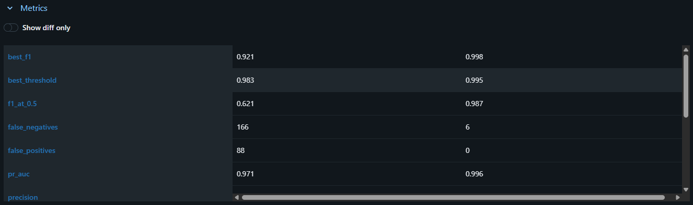
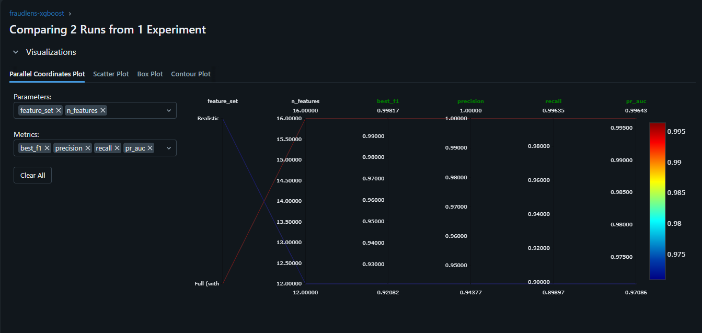

# FraudLens
### Agentic Fraud Investigation System

> **Live demo:** **https://d30g6wz74gv38k.cloudfront.net/** — fully serverless on AWS (CloudFront + S3 frontend, Lambda streaming API), ~$0 idle.

A LangGraph-orchestrated fraud investigation agent built on the PaySim dataset (6.3M transactions). The agent autonomously selects and sequences tools — fraud scoring, SHAP explanation, account velocity analysis, and regulatory retrieval — based on transaction risk context.

**Target roles:** Agentic/GenAI Engineer · ML Engineer · MLOps/ML Platform Engineer

---

## Architecture

```
Raw CSV (470MB)
    │
    ▼
Dask Pipeline (6.3M rows, chunked)
    │  balance anomaly detection
    │  rolling velocity windows
    │
    ▼
Feature Engineering → features.parquet (112MB, 2.7M rows)
    │
    ▼
XGBoost + SMOTE → xgboost_fraud_realistic.json (1.75MB)
    │
    ▼
SHAP TreeExplainer
    │
    ▼
LangGraph Agent ──► run_fraud_model()        (Claude Haiku 4.5
                ──► explain_prediction()       ReAct orchestration)
                ──► retrieve_regulations()  ◄── FAISS RAG (OSFI/FINTRAC)
                ──► check_account_velocity()
                    │
                    ▼
              FastAPI + SSE streaming   (Docker → AWS Lambda, deployed)
                    │
                    ▼
              React Frontend            (CloudFront + S3, deployed)
```

See [Live Deployment](#live-deployment-serverless-on-aws) for the running serverless architecture.

---

## Model Performance

Trained on TRANSFER + CASH_OUT transactions only (~2.7M of 6.3M rows).
Realistic feature set — balance leakage flags excluded (see [Architecture Decisions](#architecture-decisions)).

| Metric | Value |
|---|---|
| Recall (fraud class) | **89.9%** |
| Precision (fraud class) | **94.4%** |
| F1 (fraud class) | **92.1%** |
| ROC-AUC | 0.9984 |
| PR-AUC | 0.9709 |
| Optimal threshold | 0.983 |
| False positives (test set) | 88 / 552,439 |
| False negatives (test set) | 166 / 1,643 |

> **Why not accuracy?** With a 0.13% fraud rate, predicting all transactions as legitimate achieves 99.87% accuracy while catching zero fraud. Recall on the fraud class is the correct primary metric.

---

## Data Engineering Pipeline

### Dataset
- **Source:** PaySim — synthetic mobile money transaction simulator
- **Size:** 6,362,620 rows × 11 columns, 470MB CSV
- **Fraud rate:** 8,213 fraud / 6,354,407 legitimate = **0.13%**
- **Fraud types:** TRANSFER and CASH_OUT only (other types contain zero fraud)

### Stage 1 — Chunked ingestion (Pandas)

Reading 470MB into memory at once risks OOM on standard hardware.
Solution: chunked ingestion in 500k-row batches with per-chunk memory profiling.

| Chunk | Rows | Peak memory | Time |
|---|---|---|---|
| 1 | 500,000 | ~45MB | ~2s |
| … | … | … | … |
| 13 | 362,620 | ~35MB | ~1.5s |
| **Total** | **6,362,620** | **<50MB per chunk** | **~25s** |

Key finding: chunked ingestion keeps peak memory flat regardless of dataset size.
This is the pattern used in production ETL — load, transform, release, repeat.

### Stage 2 — Dask EDA (full 6.3M rows)

Dask processes the full dataset without loading it into RAM by operating on lazy partitions.

**Class distribution:**
```
Legitimate : 6,354,407  (99.8710%)
Fraud      :     8,213  ( 0.1290%)
```

**Fraud rate by transaction type:**
```
TRANSFER  : fraud present  ← model trained on this
CASH_OUT  : fraud present  ← model trained on this
PAYMENT   : 0 fraud        ← excluded
DEBIT     : 0 fraud        ← excluded
CASH_IN   : 0 fraud        ← excluded
```

**Balance anomaly detection:**
Classic PaySim fraud signature — origin balance wiped to zero, destination balance unchanged.
Flagging this pattern alone achieves high precision, but see [Label Leakage](#label-leakage-note) below.

### Stage 3 — Feature engineering

Filters to TRANSFER + CASH_OUT first (2,770,409 rows), then computes in pandas (fits in ~500MB RAM).

| Feature | Type | Description |
|---|---|---|
| `log_amount` | Derived | `log1p(amount)` — reduces right skew |
| `type_encoded` | Encoded | 1=TRANSFER, 2=CASH_OUT |
| `orig_balance_diff` | Derived | Expected vs actual origin balance drop |
| `dest_balance_diff` | Derived | Expected vs actual dest balance rise |
| `orig_zero_after` | Binary | Origin balance wiped to zero |
| `dest_unchanged` | Binary | Destination balance didn't change |
| `velocity_cumcount` | Velocity | Cumulative txn count for this account |
| `velocity_1hr` | Velocity | Txns by this account in same hour |
| `velocity_3hr` | Velocity | Txns by this account in same 3hr window |
| `velocity_24hr` | Velocity | Txns by this account in same day |

**Output:** `Dataset/features.parquet` — 112MB (76% compression vs CSV equivalent)

**Velocity implementation note:** initial implementation used `expanding().count()` inside Dask `map_partitions` — O(n²) per partition, caused >20 minute hangs. Replaced with `groupby().transform("count")` — O(n log n), vectorised, completes in ~4 minutes.

### Stage 4 — SMOTE oversampling

Raw training set: 2,216,327 rows, 6,570 fraud (0.30%).
After SMOTE: balanced 50/50 split for training. Test set untouched (stratified, real distribution).

### Label Leakage Note

Initial training with all engineered features achieved near-perfect metrics:
`Recall=99.6%, Precision=100%, F1=99.8%`

**Root cause:** PaySim's fraud generation mechanism sets `newbalanceOrig=0` and never credits `newbalanceDest` for every fraud transaction. Features `orig_zero_after` and `dest_unchanged` therefore directly encode the fraud label — they are simulation artifacts, not real-world signals.

**Resolution:** trained two models:
1. `xgboost_fraud.json` — full features (baseline, confirms pipeline works)
2. `xgboost_fraud_realistic.json` — excludes balance leakage flags (**used in production API**)

The realistic model's metrics represent honest performance. In production, balance discrepancy flags would only be known post-settlement, not at transaction time.

---

## Experiment Tracking (MLflow)

Both models are trained as separate **MLflow runs** under the `fraudlens-xgboost` experiment, making the leakage investigation reproducible and auditable side-by-side. Each run logs:

- **Parameters** — feature set, feature list, XGBoost hyperparameters, resampling strategy
- **Metrics** — ROC-AUC, PR-AUC, tuned threshold, precision/recall/F1, full confusion-matrix counts, and metrics at the default 0.5 threshold for comparison
- **Artifacts** — the precision-recall curve plot and the serialized XGBoost model (`mlflow.xgboost.log_model`)

```bash
python src/ml/train.py                                      # trains both models, logs both runs
mlflow ui --backend-store-uri sqlite:///mlflow.db           # http://localhost:5000 to compare runs
```

> Tracking uses a SQLite backend (`mlflow.db`) — MLflow 3.x deprecated the legacy file store in favour of a DB backend, which also enables the model registry.

### Side-by-side run comparison

The MLflow comparison view turns the leakage investigation into reproducible, auditable evidence:

| Metric | Full (with leakage) | Realistic (production) |
|---|---|---|
| PR-AUC | 0.996 | 0.971 |
| Precision (fraud) | 1.000 | 0.944 |
| Recall (fraud) | 0.996 | 0.899 |
| F1 (fraud) | 0.998 | 0.921 |
| F1 @ default 0.50 threshold | 0.987 | 0.621 |
| False positives (of 552,439 legit) | 0 | 88 |
| False negatives (of 1,643 fraud) | 6 | 166 |
| ROC-AUC | 0.9986 | 0.9984 |

Two findings this table makes obvious:

1. **The leakage smoking gun.** The full-feature model produces *zero* false positives and only 6 false negatives across 554k test transactions — performance no honest fraud model achieves. That "too perfect" signature is exactly what the leaked `orig_zero_after` / `dest_unchanged` features inject. The realistic model's 88 FP / 166 FN is what real-world difficulty looks like.
2. **ROC-AUC is misleading on imbalanced data.** Both models score ~0.998 ROC-AUC despite very different real-world quality — which is precisely why this project reports **PR-AUC, precision, and recall** as headline metrics, never ROC-AUC or accuracy.

**Threshold-tuning value:** the realistic model scores just 0.621 F1 at the default 0.50 threshold, but 0.921 after tuning to 0.983 on the precision-recall curve — a concrete demonstration of why threshold selection is non-negotiable on imbalanced data.


*MLflow metrics comparison — every metric side-by-side; the leaky run is "too perfect" across the board.*


*Parallel-coordinates view across PR-AUC, precision, recall, and F1 — the lines diverge where it matters (ROC-AUC, which doesn't, is deliberately excluded).*

---

## Live Deployment (Serverless on AWS)

**Live:** **https://d30g6wz74gv38k.cloudfront.net/**

```
Browser  ──HTTPS (public)──►  CloudFront
                                 ├─ /              → S3 bucket (React app, private via OAC)
                                 └─ /investigate, /predict, /explain, /health, /model-info
                                                   → Lambda Function URL (RESPONSE_STREAM)
                                                       └ FastAPI + Lambda Web Adapter
                                                          └ XGBoost · SHAP · FAISS RAG · Claude agent
Secret: Anthropic API key in SSM Parameter Store (SecureString, KMS), fetched at startup
```

Fully serverless, **~$0 when idle** (pay-per-request), one public domain, SSE streaming preserved end-to-end.

**Key engineering decisions**

- **Lambda Function URL + Lambda Web Adapter — not API Gateway.** API Gateway buffers the full Lambda response, which would collapse the `/investigate` live tool-trace into a single dump. A Function URL in `RESPONSE_STREAM` mode is the only way to stream SSE from Lambda; the Web Adapter runs the unmodified FastAPI/uvicorn app as-is.
- **CloudFront fronts both origins.** The frontend and API share one domain, so browser→API calls are same-origin (no CORS), and the function is reached through the CDN rather than directly.
- **Secrets never enter the image.** `.env` is gitignored and excluded from the Docker build; the Anthropic key lives in SSM Parameter Store (SecureString) and is fetched at container startup.
- **Cold-start hardening.** An EventBridge rule pings `/health` every 5 min to keep a container warm; CloudFront's origin read timeout is raised to 60s so a rare cold start completes instead of 504'ing.

**Two non-obvious bugs solved during deployment**:

1. **Post-Oct-2025 Function URLs require *both* `lambda:InvokeFunctionUrl` and `lambda:InvokeFunction`** in the resource-based policy — granting only the first returns a 403 that masquerades as an account-level block.
2. **CloudFront Origin Access Control can't sign POST request bodies** (`InvalidSignatureException` on POST, GET fine) — resolved by setting the Lambda OAC to non-signing and using a public (`NONE`) Function URL behind the distribution.

**Deploy:** `deploy/deploy.ps1` (build → ECR → Lambda + Function URL) then `deploy/cloudfront.ps1` (S3 + OAC + CloudFront + frontend build/upload). Both idempotent; account ID auto-resolved from credentials. See [`deploy/README.md`](deploy/README.md).

---

## Technology Stack

| Layer | Technology |
|---|---|
| Data Engineering | Pandas (chunked), Dask 2026.3.0, NumPy, PyArrow |
| ML / Modelling | XGBoost 3.2.0, Scikit-learn 1.8.0, imbalanced-learn 0.14.1 (SMOTE) |
| Explainability | SHAP 0.52.0 (TreeExplainer), Matplotlib |
| Experiment Tracking | MLflow 3.13.0 (params, metrics, artifacts, model logging) |
| Agentic AI | LangGraph 1.2.2, LangChain 1.3.2 |
| LLM Inference | Anthropic Claude Haiku 4.5 (via API, `langchain-anthropic`) |
| RAG | FAISS 1.14.2, sentence-transformers 5.5.1 |
| API | FastAPI 0.136.3, Pydantic 2.13.4, Uvicorn, SSE |
| Frontend | React 18, Vite, Tailwind CSS, Recharts, Axios |
| Cloud — Backend | AWS Lambda (container image) + Lambda Web Adapter, Function URL (RESPONSE_STREAM), ECR |
| Cloud — Frontend/CDN | CloudFront + S3 (private origin via OAC) |
| Secrets | SSM Parameter Store (SecureString) |
| Reliability | EventBridge warm-ping (cold-start mitigation) |
| DevOps | Docker, pytest |

---

## Architecture Decisions

### Why LangGraph over a fixed pipeline?
v1 used a fixed sequence: data → model → SHAP → LangChain → RAG → report.
v2 replaces this with a ReAct-style agent that decides which tools to call based on what it observes. Low-risk transactions skip SHAP and RAG entirely. High-risk ones trigger all four tools in a reasoned sequence. The agent's tool selection logic is testable, explainable, and extensible without touching the pipeline.

### Why Dask over Spark?
Spark requires cluster orchestration that is unnecessary for a single-machine 6.3M row dataset. Dask provides the same distributed-processing mental model with a familiar pandas-like API, zero cluster setup, and runs locally on a laptop. For datasets requiring multi-node processing (100M+ rows), Spark would be the right call.

### Why XGBoost over a neural network?
XGBoost produces exact SHAP attributions via `TreeExplainer`. Neural network SHAP requires `DeepExplainer` or `GradientExplainer`, which are approximations and significantly slower. Model auditability is a regulatory requirement in financial services — exact attributions are non-negotiable.

### Why FAISS over Pinecone or Weaviate?
FAISS runs locally with zero cost and zero latency overhead for ~50 compliance documents. For production at millions of documents, multi-user access, and SLA requirements, Pinecone or Weaviate is appropriate. This is an explicit scope decision documented here rather than a technical limitation.

### Why a hosted LLM API (Claude) over self-hosting a model in Lambda?
Self-hosting (e.g. Ollama or a HuggingFace model in-container) requires loading 4–7GB of weights into the Lambda container, producing a 10GB+ Docker image and 60–90s cold starts. A hosted inference API offloads the LLM entirely; the container (~4.4GB — CPU-only PyTorch + the MiniLM embedder for RAG) stays well under Lambda's 10GB image limit and avoids LLM cold-start latency.

**Why Claude Haiku 4.5 specifically?** The agent depends on reliable tool-calling and structured output — Claude's tool-use is well-suited to the LangGraph ReAct loop and produces clean, citation-grounded investigator reports. Haiku is the cheapest, fastest model in the family, which keeps per-investigation cost low. *(Note: the original project scope specced HuggingFace Mistral-7B; it was switched to Claude during build for materially more reliable tool-calling and report quality — a deliberate change, not a default.)*

**Cost control.** Because the LLM is metered per token, the agent was optimized to minimize tokens: a terse system prompt and tool schemas, truncated RAG retrieval payloads, and `max_tokens` bounding the report. This brought cost from ~2¢ to ~0.5¢ per investigation.

### Why a Lambda Function URL over API Gateway?
API Gateway buffers the entire Lambda response before returning it, which would break the `/investigate` SSE live-trace (the agent's tool steps would arrive as one batch instead of streaming). A Lambda **Function URL in `RESPONSE_STREAM` mode** is the only managed way to stream responses from Lambda, and the **Lambda Web Adapter** lets the existing FastAPI/uvicorn app run unchanged in the container. The original scope assumed API Gateway; it was switched to a Function URL specifically to preserve streaming.

### Why CloudFront in front of a Function URL?
Browsers can't SigV4-sign requests, so the API can't be IAM-authed directly from the page. CloudFront serves the React app and proxies the API on **one domain** (same-origin, no CORS) while the Function URL stays the single API origin. (OAC signing is disabled on the Lambda origin because OAC cannot sign POST bodies — see [Live Deployment](#live-deployment-serverless-on-aws).)

### Why EventBridge warm ping over provisioned Lambda concurrency?
Provisioned concurrency costs $40–100/month. An EventBridge rule pinging `/health` every 5 minutes costs ~$0.00/month (well within the free tier) and keeps a container warm so demo visitors avoid cold-start latency. Provisioned concurrency is appropriate at production traffic volumes; EventBridge is appropriate for a portfolio demo.

### Why SSE over WebSockets for agent trace streaming?
SSE is one-directional (server → client), which is exactly what agent step streaming requires. WebSockets add bidirectional connection management overhead that provides no benefit for this use case. SSE is simpler to implement, simpler to debug, and natively supported by FastAPI's `StreamingResponse`.

---

## Infrastructure Cost

**AWS infrastructure (~$0.29/month when deployed):**

| Service | Cost | Notes |
|---|---|---|
| AWS Lambda | ~$0.02 | pay-per-request, 3008MB; ~$0 idle |
| ECR | ~$0.44 | ~4.4GB container image |
| CloudFront + S3 | ~$0.01 | React bundle + API proxy, low traffic |
| SSM Parameter Store | ~$0.00 | 1 SecureString (standard tier, free) |
| EventBridge | ~$0.00 | warm-ping every 5 min (free tier) |
| **Subtotal** | **~$0.47/mo** | dominated by ECR image storage |

**LLM inference (Anthropic Claude Haiku 4.5, metered per token):**

| | Cost |
|---|---|
| Per investigation | **~0.5¢** (~2,400 input + ~800 output tokens) |
| A 20-run demo session | ~10¢ |
| $5 of credit | ~1,000 investigations |

> Inference is pay-as-you-go, not a flat fee — you only pay when the agent runs. Set an Anthropic billing alert and an AWS billing alert at $5 each before deploying.

---

## Local Setup

```bash
git clone https://github.com/adithyaraj/FraudLens.git
cd FraudLens

python -m venv venv
venv\Scripts\activate          # Windows
# source venv/bin/activate     # Mac/Linux

pip install -r requirements.txt

# Download PaySim dataset → Dataset/paysim.csv
# https://www.kaggle.com/datasets/ealaxi/paysim1

# Run pipeline in order
python src/data/ingest.py      # Day 1 — chunked ingestion + memory profile
python src/data/eda.py         # Day 2 — Dask EDA + charts
python src/data/features.py    # Day 3 — feature engineering → features.parquet
python src/ml/train.py         # Day 4 — XGBoost + SMOTE training
python src/ml/explain.py       # Day 5 — SHAP waterfall plots

# Start API
uvicorn src.api.main:app --reload
# Docs at http://localhost:8000/docs

# Run tests
pytest tests/ -v
```

---

## Project Status

- [x] Phase 1 — ML Core (Dask + XGBoost + SHAP + FastAPI)
- [x] Phase 2 — LangGraph learning track (toy agent)
- [x] Phase 3 — Agentic layer + RAG (FAISS over 25 OSFI/FINTRAC docs) + SSE streaming
- [x] Phase 4 — React frontend + AWS deployment
  - [x] React + TypeScript + Tailwind + Recharts frontend (form, live SSE trace, SHAP chart, investigator report, API health indicator)
  - [x] Docker + AWS Lambda (container image, Function URL streaming via Lambda Web Adapter)
  - [x] CloudFront + S3 hosting for the frontend (single domain, OAC, secrets in SSM)
  - [x] Cold-start hardening (EventBridge warm-ping + 60s CloudFront origin timeout)
- [ ] Phase 5 — MLOps hardening (planned)
  - [ ] `/monitor` drift endpoint + logging
  - [ ] GitHub Actions CI/CD
  - [ ] Warm-ping scripted into the deploy (currently set up live, not yet in `deploy.ps1`)

---

*Built by Adithya Raj · May 2026*
